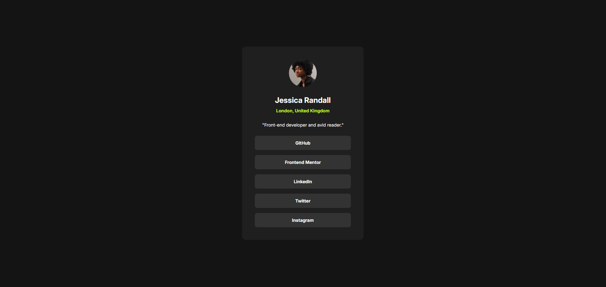

# Frontend Mentor - Social links profile solution

This is a solution to the [Social links profile challenge on Frontend Mentor](https://www.frontendmentor.io/challenges/social-links-profile-UG32l9m6dQ).

## Table of contents

- [Overview](#overview)
  - [Screenshot](#screenshot)
  - [Links](#links)
- [My process](#my-process)
  - [Built with](#built-with)
  - [What I learned](#what-i-learned)
- [Author](#author)

**Note: Delete this note and update the table of contents based on what sections you keep.**

## Overview

### Screenshot

### Links

- Solution URL: [Add solution URL here](https://github.com/shakthivel-rn/social-links-profile)
- Live Site URL: [Add live site URL here](https://shakthivel-rn.github.io/social-links-profile/)

## My process

### Built with

- HTML5
- CSS3
- Flexbox

### What I learned

- Learned about accessibility
- Learned how to make the component responsive
- Learned how to animate differently for hover in and hover out using ease in for hover in and ease out for hover out (Hover in effect happens quickly compared to hover out)

## Author

- Website - [Shakthivel Ramesh Nirmala](https://shakthivel-portfolio.vercel.app/)
- Frontend Mentor - [@shakthivel-rn](https://www.frontendmentor.io/profile/shakthivel-rn)
